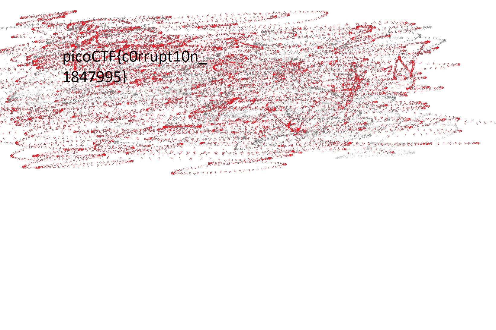

## Descripcion
We found this [file](https://jupiter.challenges.picoctf.org/static/ab30fcb7d47364b4190a7d3d40edb551/mystery). Recover the flag.

## Hints
- Try fixing the file header

# Solucion

En este reto se nos proporciona una imagen, en el cual esta se encuentra corrupta, nuestra tarea en este desafio es arreglar los problemas de esta imagen y poder visualizar la imagen. 

Lo primero que hacemos es analizar la imagen con el comando file:

- `file mystery`
Obtenemos la siguiente salida:

`mystery: data`

En este caso, tenemos que es un archivo solo de datos, pero nada mas. Asi que usamos `hexeditor` para analizar los bytes que tiene este archivo:

bytes del archivo `mystery`: 
```
00000000  89 65 4E 34  0D 0A B0 AA   00 00 00 0D  43 22 44 52                                                                                           .eN4........C"DR
00000010  00 00 06 6A  00 00 04 47   08 02 00 00  00 7C 8B AB                                                                                           ...j...G.....|..
00000020  78 00 00 00  01 73 52 47   42 00 AE CE  1C E9 00 00                                                                                           x....sRGB.......
00000030  00 04 67 41  4D 41 00 00   B1 8F 0B FC  61 05 00 00                                                                                           ..gAMA......a...
00000040  00 09 70 48  59 73 AA 00   16 25 00 00  16 25 01 49                                                                                           ..pHYs...%...%.I
00000050  52 24 F0 AA  AA FF A5 AB   44 45 54 78  5E EC BD 3F                                                                                           R$......DETx^..?
00000060  8E 64 CD 71  BD 2D 8B 20   20 80 90 41  83 02 08 D0                                                                                           .d.q.-.  ..A....
00000070  F9 ED 40 A0  F3 6E 40 7B   90 23 8F 1E  D7 20 8B 3E                                                                                           ..@..n@{.#... .>
00000080  B7 C1 0D 70  03 74 B5 03   AE 41 6B F8  BE A8 FB DC                                                                                           ...p.t...Ak.....
00000090  3E 7D 2A 22  33 6F DE 5B   55 DD 3D 3D  F9 20 91 88                                                                                           >}*"3o.[U.==. ..
000000A0  38 71 22 32  EB 4F 57 CF   14 E6 25 FF  E5 FF 5B 2C                                                                                           8q"2.OW...%...[,
000000B0  16 8B C5 62  B1 58 2C 16   8B C5 62 B1  58 2C 16 1D                                                                                           ...b.X,...b.X,..
000000C0  D6 D7 67 8B  C5 62 B1 58   2C 16 8B C5  62 B1 58 2C                                                                                           ..g..b.X,...b.X,
000000D0  16 8B 45 97  F5 F5 D9 62   B1 58 2C 16  8B C5 62 B1                                                                                           ..E....b.X,...b.
000000E0  58 2C 16 8B  C5 62 D1 65   7D 7D B6 58  2C 16 8B C5                                                                                           X,...b.e}}.X,...
000000F0  62 B1 58 2C  16 8B C5 62   B1 58 74 59  5F 9F 2D 16                                                                                           b.X,...b.XtY_.-.
00000100  8B C5 62 B1  58 2C 16 8B   C5 62 B1 58  2C 16 5D D6                                                                                           ..b.X,...b.X,.].
00000110  D7 67 8B C5  62 B1 58 2C   16 8B C5 62  B1 58 2C 16                                                                                           .g..b.X,...b.X,.

```

En la primera fila de los bytes se establece que tipo de imagen es, por lo que modificamos. En este caso analizamos y vemos que dice `EN4` que se parece a un `PNG`, entonces escribimos: 
`89 50 4E 47 0D 0A 1A 0A`

Ahora el archivo debe ser un png pero aun no lo detecta. Entonces seguimos modificando.
Observamos que al final de los strings encontramos lo siguiente:
`.C"DR` Si tratamos de abrir la imagen en este momento, dara error en el chunk de `CVR` y nosotros queremos el chunk de `IHDR` , Entonces modificamos la cadena.


```
00 00 00 0D  49 48 44 52
```

Ahora si le hacemos un file y ahora si reconoce el archivo como una imagen:

`mystery: PNG image data, 1642 x 1095, 8-bit/color RGB, non-interlaced

Si intentamos abrir la imagen obtenemos este error: 

```
# Could not Load Image

Remote error: org.gnome.glycin.Error.LoadingError: loaders/glycin-image-rs/src/bin/glycin-image-rs.rs.214:52: Format error decoding Png: ChunkType { type: CV'DR, critical: true, private: true, reserved: false, safecopy: false } chunk appeared before IHDR chunk
```

El error tiene que ver con los chunks por lo que tenemos que modificar lo siguiente:

1. Buscamos la secuencia del chunk `PHYS` (AA 00 16 25 00)
	1. Modificamos AA por 00
2. Buscamos el chunk IDAT en este caso aparece como "DETx" ( AB 44 45 54 78)
	1. Modificamos por 49 44 41
3. Modificamos la longitud del chunk, buscamos la secuencia ( 52 24 F0 AA AA )
	1. Modicamos esos dos AA POR 00 (52 24 FO 00 00)

